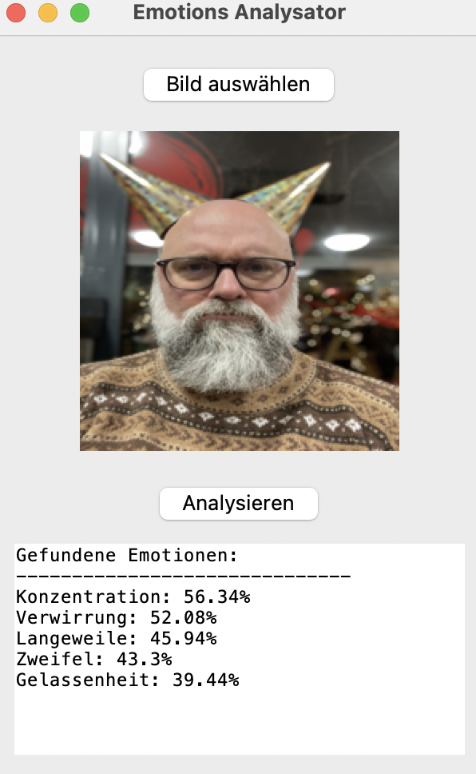

# Face Expression Analyzer

Eine Python-Anwendung zur Analyse von Gesichtsausdrücken mithilfe der Hume AI API.

<!-- Bild mit 500px Breite -->



## 🌟 Features

- Benutzerfreundliche grafische Oberfläche
- Analyse von Gesichtsausdrücken in Bildern
- Erkennung von über 40 verschiedenen Emotionen
- Ausgabe der Top 5 erkannten Emotionen mit Wahrscheinlichkeiten
- Vollständige deutsche Übersetzung der Emotionen

## 🚀 Installation

1. Repository klonen:

bash
git clone https://github.com/IhrUsername/face-expression-analyzer.git
cd face-expression-analyzer

2. Virtuelle Umgebung erstellen und aktivieren:

```bash
python -m venv venv
source venv/bin/activate  # Unter Windows: venv\Scripts\activate
```

3. Abhängigkeiten installieren:

```bash
pip install -r requirements.txt
```

4. `.env` Datei erstellen:

```plaintext
HUME_API_KEY=Ihr_API_Key
HUME_SECRET_KEY=Ihr_Secret_Key
```

## 💻 Verwendung

1. Programm starten:

```bash
python facial_analysis_gui.py
```

2."Bild auswählen" klicken und ein Bild mit einem Gesicht auswählen
3."Analysieren" klicken
4.Die Top 5 erkannten Emotionen werden angezeigt

## 🔑 API-Zugang

Um die Anwendung nutzen zu können, benötigen Sie einen API-Key von Hume AI:
1.Registrieren Sie sich auf [dev.hume.ai](https://dev.hume.ai)
2.Generieren Sie einen API-Key und Secret-Key
3.Fügen Sie beide Keys in die `.env` Datei ein

## 🛠 Technologien

- Python 3.12
- Hume AI API
- tkinter für die GUI
- PIL (Python Imaging Library)
- python-dotenv für Umgebungsvariablen

## 📝 Lizenz

Dieses Projekt ist unter der MIT-Lizenz lizenziert. Weitere Details finden Sie in der [LICENSE](LICENSE) Datei.

## 👥 Beitragen

Beiträge sind willkommen! Bitte erstellen Sie einen Pull Request oder öffnen Sie ein Issue für Vorschläge und Verbesserungen.

## 🙏 Danksagung

- [Hume AI](https://hume.ai) für die Bereitstellung der Emotions-Analyse-API
- Alle Mitwirkenden und Tester

## Autor

Christian Kolb

## Kontakt

Wenn Sie Fragen haben oder einen Beitrag leisten möchten, zögern Sie nicht, uns über unsere Webseite zu kontaktieren: [pflege-ai.de](https://pflege-ai.de/).

[](https://pflege-ai.de/)

## Follow me on Social Media

[](https://www.threads.net/@pflege_ki)

[](https://twitter.com/ai_fuerth)

[](https://www.instagram.com/pflege_ki/)

## Support my work

[](https://buymeacoffee.com/pflege_ki)
